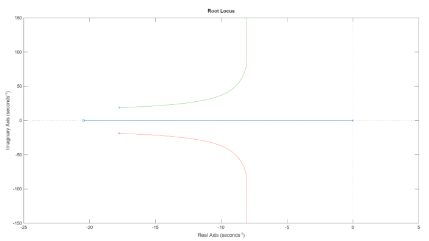
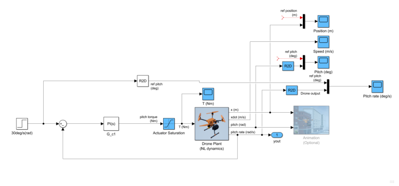
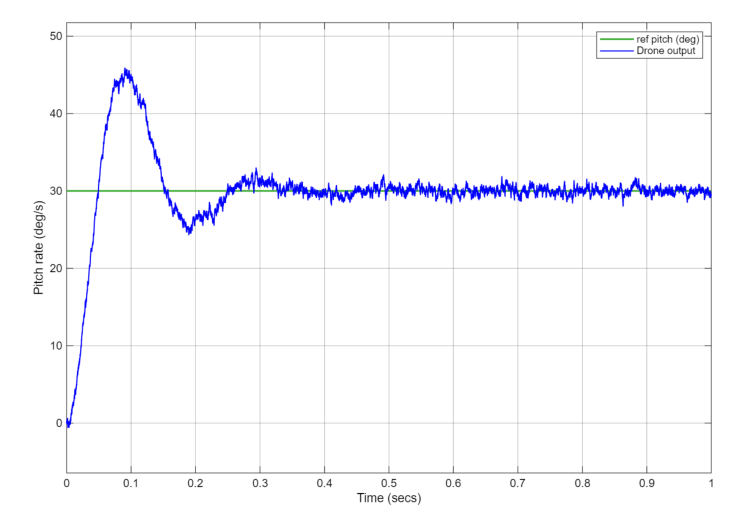
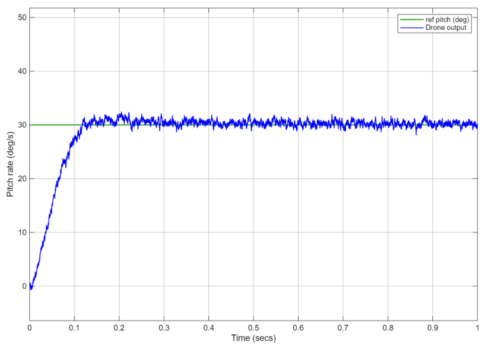
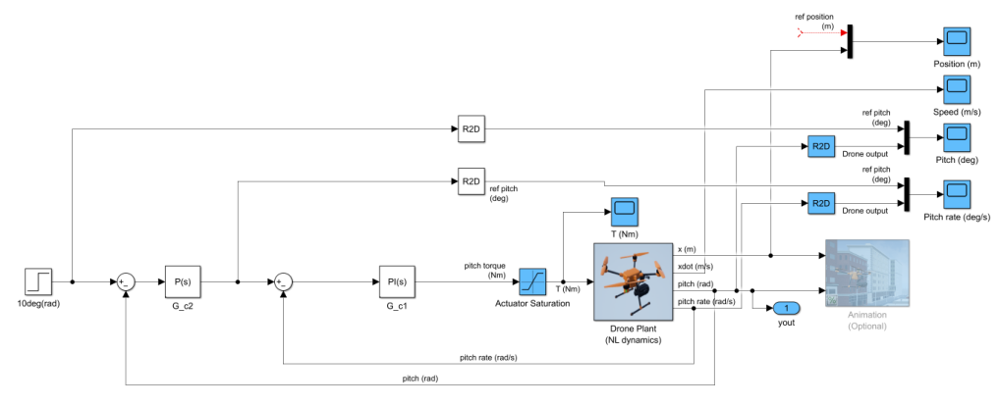
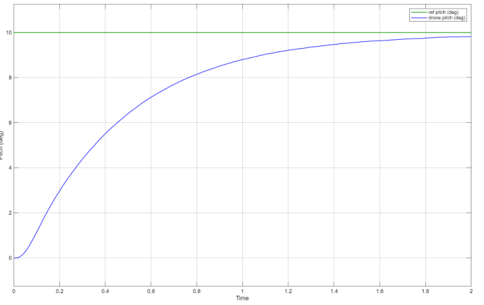
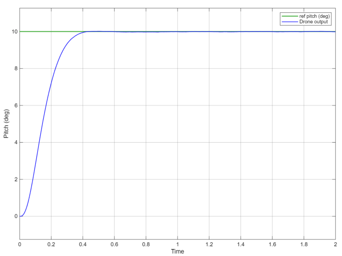
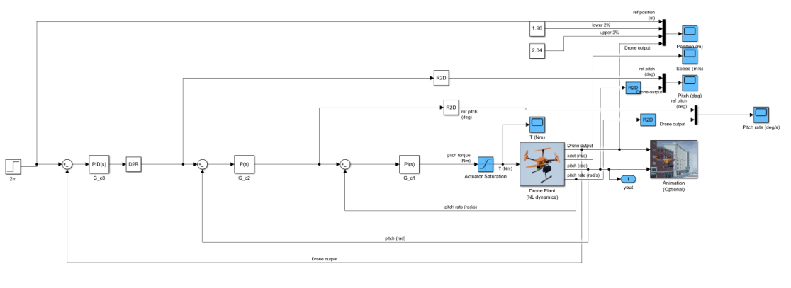
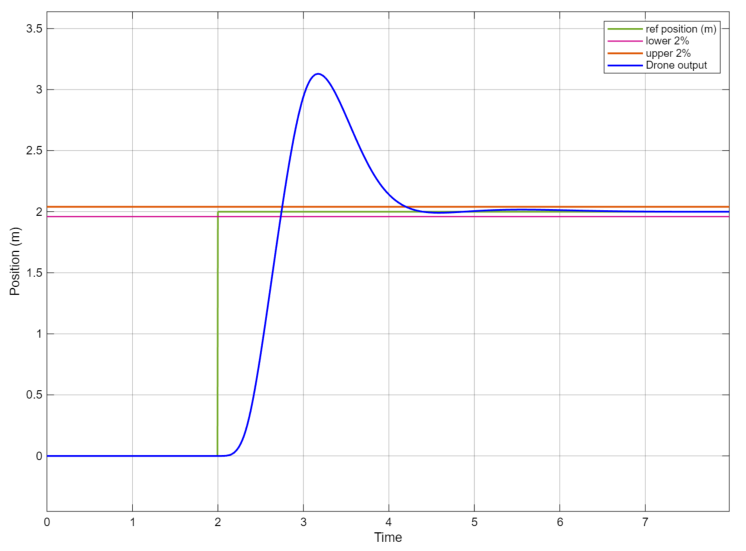

# Design and tuning a PID controller

## Overview
This project required the implementation of a PID controller for a UAV drone. The drone needed to achive certain targets which was required from the assignment. The full report can be seen in the report PDF in the added files.

## Objectives
- Calculate the correct transfer functions required.
- Add the PID controller to the given SIMULINK model.
- Ensure the drone output achieves the target.
  
## Tools and concepts used
- Control system theory (understanding PID controller and how each component affects the output)
- SIMULINK
- LyX and LaTeX for writing up the report

## Methodology
- Calculated the transfer functions for pitch rate loop, pitch angle loop from the block diagrams.
- Used root locus plot to understand gains which would keep the pitch angle loop stable.
- Building a controller using the initial calculated TF.
- The total PID controller would have a step reference input from 0m to 2m at 2 seconds. The controller had to achieve a step response of 2% settling time below 3 seconds, and a zero steady-stete error.

## Results
- The transfer functions calculated for pitch rate loop and pitch angle loop were correct.
- The calculated disturbance transfer function was unfortunately calculated incorrectly.
- However, the final output of the drone managed to reach the desired step response 2% settling time of approximately 2.2 seconds and a zero steady state error.
- From the animation, the drone works well.

## Project images
The full calculations of the assignent can be found in the report pdf.

  

  <i>Figure 1: Root Locus plot</i>

 
The root locus plot shows that the system is stable for all values of K>0.

  

  <i>Figure 2: Pitch rate controller (PI) implemented in Simulink model </i>

  

  <i>Figure 3: Pitch rate output from calculated gains and step input of 30deg/s at 0 seconds </i>

 

The caculated gains for the PI controller were Kp=0.325 and Ki=6.65. The rise time was 0.04 seconds and had a percentage overshoot of 47.1%. The steady state error was eliminated due to the integral term. The PI controller had to have rise time of less than or equal to 0.1 seconds, percentage overshoot of less than or equal to 5% and zero steady state error.

  

  <i>Figure 4: Tuned PI controller for pitch rate output from step input of 30deg/s at 0 seconds </i>

 

With the new Kp and Ki values of 0.19 and 0.38, the rise time reduced to 0.09 seconds and there was a percentage overshoot of 4.22%. Thus, the requirements were reached. 

  

  <i>Figure 5: Pitch controller (P) implemented in Simulink model </i>

  

  <i>Figure 6: Output pitch angle </i>

 

Propotional controller calculated gain was 6.3. There was a step input of 10 degrees at 0 seconds. The P controller had to have a rise time of less than 0.3 seconds and a percentage overshoot less than 5%. Currently, it had a rise time and percentage overshoot of 0.97 seconds and 0%.

  

  <i>Figure 7: Tuned P controller for output pitch angle </i>

The final Kp value for the P controller was 6.3. This resulted in a rise time of 0.217 seconds and a percentage overhoot of 0.1%. 

  

  <i>Figure 8: Position controller (PID) implemented in the Simulink model  </i>

A step input that holds the drone at rest at 0 metres and then steps to 2m at 2 seconds was implemented. The controller had to achieve a step response of a 2% settling time below 3 seconds and zero steady state error. 

  

  <i>Figure 9: Drone position with tuned PID controller </i>

As there was still a pole at s=0, the steady state error was 0, which led to KI=0. Firstly, the Kp was adjusted till it could no longer be adjusted and started to be unstable. Upon reaching that value, Kd was introduced to dampen the system. As the Kd reached its maximum value, Kp had to be adjusted until the 2% settling time of under 3 seconds was met. The final values were Kp= 19 and Kd=15.

## What I learnt
- The most important thing I learnt was how the PID gains affected the plant output.
- Managed to gain a better understanding of SIMULINK and how to use it.
- How to identify and calculate transfer functions from block diagrams.
- Learnt where I went wrong and how I lost my marks. 

<!-- 

  

  <i>Figure 1: </i>

 --!>

